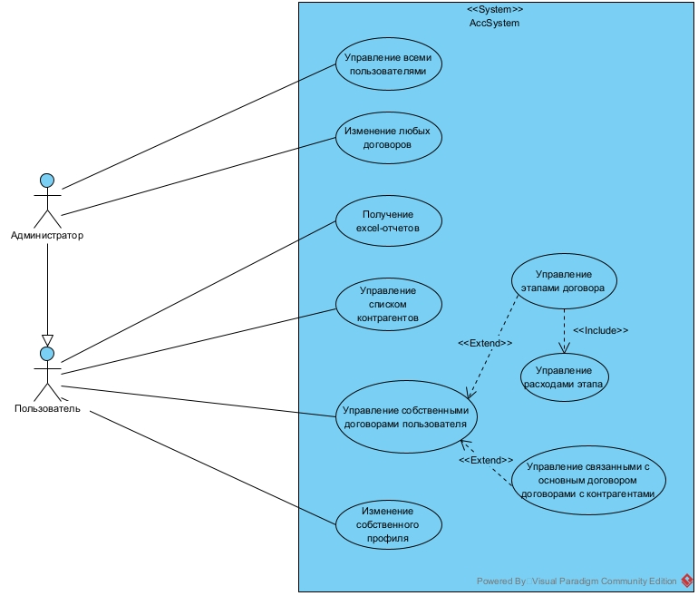
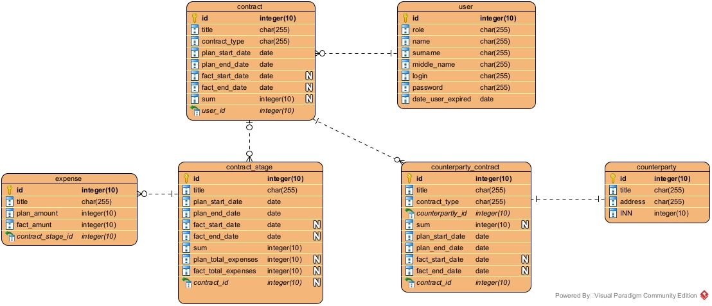

# Клиент-серверное приложение "Учетная система" (Java 8, Spring - backend; js, vue - frontend) ([LEARNING_CENTER-22](http://jira.nicetu.spb.ru/jira/browse/LEARNING_CENTER-22))

## Инструкция по запуску (in dev mode)

### Сборка и запуск в Docker-контейнере

1. Склонировать проект, перейти в корневую директорию проекта, затем перейти в нужную ветку (в данный момент актуальная версия находится в ветке develop)
2. Запустить, выполнив:

       docker-compose up

   При первом запуске Spring-приложения в docker-контейнере может произойти ошибка из-за того, что MySQL база данных не
   успеет запуститься к старту Spring-приложения. Чтобы преодолеть эту ошибку и для простоты в docker-compose был
   выставлен параметр 'restart: always', чтобы попытаться запуститься вновь (к этому моменту база данных уже должна
   будет запуститься...)

3. Клиентская часть запущенного приложения будет доступна по адресу: http://localhost:3000

   *Swagger-документация серверной части доступна по относительному адресу __/api__* (Если не менять значения .env
   файла, то сервер будет доступен по адресу 8080. Соответственно адрес Swagger-документации: http://localhost:8080/api)

   > Создавать пользователей можно только с ролью ADMIN, поэтому при старте приложения создается супер-пользователь (программно создаваемый пользователь с ролью ADMIN). Имя пользователя и пароль задаются переменными окружения.
   > По умолчанию:
   > логин: __superuser__,
   > пароль: __adminpass__
   >
   > В исходном файле .env эти значения уже заданы:
   >
   >     SUPERUSER_USERNAME=superuser
   >     SUPERUSER_PASSWORD=adminpass
   >
   > При необходимости их можно переопределить или использовать переменные ОС.

> Для других настроек приложения также используются переменные окружения.
>
> Их можно переопределить в файле .env (Docker берет значения из этого файла) или использовать переменные ОС.
>
> Список необходимых переменных окружения вместе со значениями из файла .env, находящегося в репозитории:
>
>     MYSQL_DATABASE_URL=jdbc:mysql://localhost:3306/accSystem
>     MYSQL_DATABASE_NAME=accSystem
>     MYSQL_DATABASE_USER=root
>     MYSQL_DATABASE_PASSWORD=root
>
>     MONGO_DATABASE_URI=mongodb://localhost:27017/accSystem
>     MONGO_DATABASE_NAME=accSystem
>
>     SUPERUSER_USERNAME=superuser
>     SUPERUSER_PASSWORD=adminpass
>
>     JWT_SECRET=accSystemSuperSecretKey
>     JWT_EXPIRATION_MS=300000
>     JWT_REFRESH_EXPIRATION_MS=86400000
>
>     PORT=8080

### Сборка и запуск в среде разработки
1. Склонировать проект, перейти в корневую директорию проекта, затем перейти в нужную ветку (в данный момент актуальная версия находится в ветке develop)
2. Развернуть пустую базу данных MySQL. Настройка не требуется - все таблицы и необходимые данные будут созданы и внесены в момент запуска приложения автоматически.
3. Развернуть базу данных Mongo. Необходимые коллекции создадутся автоматически при запуске.
4. Настроить переменные окружения (через файл .env или ОС - можно использовать файл, лежащий в репозитории). Файл .env должен находиться в папке backend, где находится Spring-приложение
5. Перейти в директорию backend и запустить сервер: 
   1. Либо при помощи среды разработки (необходимо указать переменные окружения для запуска или указать, что нужно использовать .env файл для конфигурирования), 
   2. Либо собрав jar-файл:

          mvn package -Dmaven.test.skip
   
      А затем исполнив его. При исполнении также необходимо передать все переменные окружения.

6. Перейти в директорию frontend, где находится клиентская часть и запустить командами:
   
       npm i
       npm run serve

7. Результаты запуска такие же, как и при запуске в Docker-контейнере (см. пункт 3 Сборка и запуск в Docker-контейнере)

## Описание выполненного задания (Уточнения по реализации)

[Текст задания](./sql-diagrams/Задание.docx)

### Авторизация

Используется access и refresh токены. Токены выдаются после успешного ввода пары логина и пароля. Access токен имеет
небольшое время жизни и должен обновляться по refresh-токену. При выходе из системы становится недействителен только
refresh-токен, по access-токену доступ будет сохраняться, пока не истечет его время жизни. Тем не менее access-токен все
равно будет удален с клиентской части приложения сразу после выхода.
*В исходном .env файле время жизни access-токена: 5 минут, refresh-токена: 24 часа*

Информация о входе пользователя фиксируется в Mongo базе данных

### Создание пользователей и суперпользователь

Как упоминалось ранее, суперпользователь - это создаваемый при запуске приложения пользователь с ролью ADMIN, логином и
паролем из переменных окружения.

Он необходим, так как пользователей можно создавать, изменять и получать список всех пользователей только с ролью ADMIN.
С ролью USER можно лишь изменять данные своего профиля.

Данные суперпользователя не могут быть обновлены.

### Разграничение доступа

С ролью ADMIN доступны все возможности роли USER + управление пользователями (создание, обновление, удаление, получение)
. Также на сервере с ролью ADMIN имеется доступ ко всем договорам и вложенным к ним сущностям, однако на клиентской
части нет отображения таблицы абсолютно всех договоров (даже на странице Договоры будет отображать таблица только с теми
договорами, которые принадлежат самому админу). Однако с ролью ADMIN все равно доступны карточки договоров и возможность
их изменения (хоть на клиентской части и можно открыть их только посредством прямого ввода ссылки в адресную строку
браузера)

### Формат отчетов

1. Отчет по этапам договора

   В отчет включаются все этапы договора.

   > Так как расходы этапа - это список отдельных сущностей, то они выводятся справа от этапа с использованием разбиения ячеек
   > (см. первый этап из примера ниже)

   Пример формата:
   

2. Отчет по договорам, входящим в период по плановым срокам

   Содержит все договоры (включая договоры с контрагентами) пользователя в заданном периоде по планируемым срокам. Для
   контрактов с контрагентами в отчет включаются контракты, к которым они относятся
   (даже если по плановым датам этот контракт не входит в заданный период)

   Пример формата:
   

### Поиск и пагинация

Все запросы на получение всех сущностей с фильтрацией (например всех этапов договора) поддерживают пагинацию. На
клиентской части это так же реализовано: отображается 10 сущностей в таблице вывода, подходящих под условия фильтрации.
Также есть возможость выбора страницы.

### Уточнения (допущения) к заданию

[Принятые допущения к условию](./sql-diagrams/Уточнения%20(допущения).docx)

### UML-диаграммы

ER-диаграмма

Диаграмма классов
