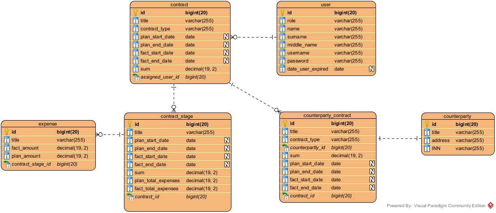

# Клиент-серверное приложение "Учетная система" (Java 8, Spring - backend; js, vue - frontend) (LEARNING_CENTER-22)
## Инструкция по запуску
### Сборка и запуск в Docker-контейнере
1. Склонировать проект
2. Перейти в корневую директорию проекта и выполнить:
  
       docker-compose up

3. Создавать пользователей можно только с ролью ADMIN, поэтому при старте приложения создается супер-пользователь (программно создаваемый пользователь с ролью ADMIN). Имя пользователя и пароль задаются переменными окружения.
   
   *Swagger-документация доступна по относительному адресу __/api__* (например: http://localhost:8080/api)

   > В исходном файле .env эти значения уже заданы:
   > 
   > SUPERUSER_USERNAME=superuser
   > 
   > SUPERUSER_PASSWORD=adminpass
   > 
   > При необходимости их можно переопределить или использовать переменные ОС.

> Для настройки приложения используются переменные окружения.
> 
> Их можно переопределить в файле .env (Docker берет значения из этого файла) или использовать переменные ОС.

### Запуск готового image из Docker Hub

## Описание выполненного задания
### Текст задания
[Ссылка]()
### Краткое описание реализации

### Уточнения к заданию

### UML-диаграммы
ER-диаграмма

Диаграмма классов
